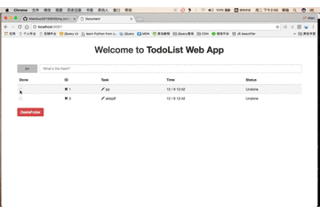

# `my_todoList_app`

 
> ####简介
此项目是由原先自己的单页应用TODOList而来，为搭配练习`AJAX`与后端交互的功能。 
后台的搭建，使用`node`及其`express`框架。后端代码也在不断优化中。 
前端样式，以`bootstrap`为主，外加自己根据实际需要而做的相应修改。 

###工具
`NodeJS`, `Express`, `BootStrap`
 
###功能
基本实现了常用功能，比如增、删、改、查等基本功能。

> 1. 增：增加功能主要有两个方面，一方面是增加分类；一方面是增加在相应分类下的任务；
2. 删：同样可以删除相应分类下的任务，以及相对应的分类目录。在点击`X`删除时，会弹出提示框，并且待删除的任务背景会显示为暗红色；
3. 改: 点击铅笔图标，可以修改当前的任务项；
4. 查： 默认显示未分类的所有事项列表，点击分类目录按钮可查看相应类别下的任务类别；
5. 标记完成：点击任务前端的方框，可将任务标记为完成状态。此时状态栏会显示“Done”字样，同时该任务北京也会相应变成提示完成的浅绿色；
6. 存储：数据的存储暂时以`JSON`的格式储存在JSON文件中。下一步的工作将逐渐使用`MangoDB`来存储数据。
